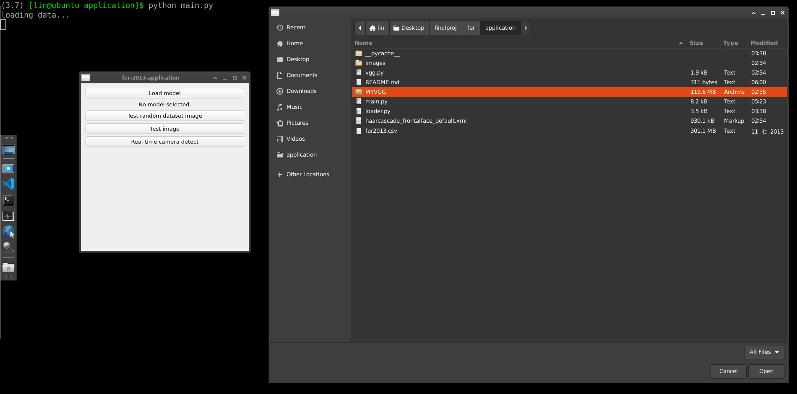

# FER-2013 VGGNet Application

This is an simple GUI application based on pyQt5.

## Usage

1. Download Our pretrained model "MYVGG" [here](https://github.com/blueskyson/fer/releases/tag/100-epoch-checkpoint) or train one by yourself.
2. Run `python main.py` and select "MYVGG" model via the "Load model" button.
   
3. Click the "Test random dataset image" to show the result of a random image from test dataset.
4. Show the result of a user-preovided image via the "Test image" button.
5. Show the result of real-time camera detector via the "Real-time camera detect" button.